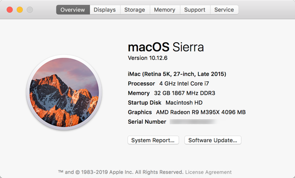

## NetDevOps
#### 2019-11-22 claudia@indigowire.net

## UbuntuDisco Dingo Ansible Ansible 2.9 "Immigrant Song" Dockerfile
 - [Latest Ubuntu 19.04 (Disco Dingo)](https://wiki.ubuntu.com/DiscoDingo/ReleaseNotes)
 
 	[Ubuntu Releases](https://wiki.ubuntu.com/Releases)
 	
 	[Ansible Ubuntu Releases](https://launchpad.net/~ansible/+archive/ubuntu/ansible)
 - Python 2.7, Python 3.6, Ansible 2.9, Nornir 2.0
 - [Ansible 2.9.1 "Immigrant Song" Release Notes](https://github.com/ansible/ansible/blob/stable-2.9/changelogs/CHANGELOG-v2.9.rst)
  


[cldeluna/disco-immigrant image](https://hub.docker.com/r/cldeluna/disco-immigrant) 
  
------


Purpose built ansible image starting with Ubuntu:18.10 Cosmic Cuttlefish base and including:
- Python 2.7 (Legacy)
- Python 3.7
- ansible 2.9.1
- git
- tree
- nano
- wget
- vim
- traceroute
- iputils-ping
- snmp
- snmp-mibs-downloader
- yaml
- jinja2
- httplib


Python Modules:
- requests
- nornir
- textfms
- openpyxl
- ciscoconfparse
- netmiko
- pandas
- PyYAML
- pyang
- pysnmp
- ncclient
- argparse 
- xlrd

Repositories:
- https://github.com/cldeluna/ansible2_4_base.git
- https://github.com/cldeluna/cisco_aci.git
- https://github.com/cldeluna/cisco_ios.git


## Build

```
Claudias-iMac:disco-immigrant claudia$ tree
.
├── AboutDocker.png
├── About_iMac.png
├── Dockerfile
└── README.md

0 directories, 4 files
```

```
Claudias-iMac:disco-immigrant claudia$ docker build -t cldeluna/disco-immigrant .
```

## Run

Run interactively and map a local directory /Users/claudia/Documents/docker_volume to the /ansible directory in the container.
```
Claudias-iMac:disco-immigrant claudia$ docker run -v  /Users/claudia/Documents/docker_volume:/ansible -it cldeluna/disco-immigrant
```

## Docker Hub

```
Claudias-iMac:disco-immigrant claudia$ docker login
Claudias-iMac:disco-immigrant claudia$ docker tag cldeluna/disco-immigrant:latest cldeluna/disco-immigrant:latest
Claudias-iMac:disco-immigrant claudia$ docker push cldeluna/disco-immigrant
```

## Environment




